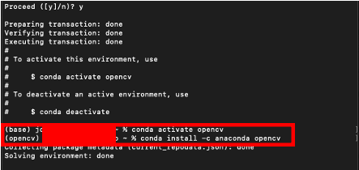
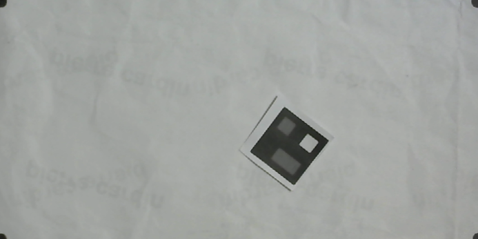

# Read Me - Codigos

## Codigos de lenguaje Python para Visión por Computadora

## Indice:
1. [Introducción](#Introducción)

2. [Requerimientos](#Requerimientos)

3. [Algoritmo Para el Reconocimiento de la Pose de Agentes en Python](#Algoritmo-Para-el-Reconocimiento-de-la-Pose-de-Agentes-en-Python)

    1. [Librería Swarm_robotic.py](#Swarm)

    2. [Librería para la Toma de Pose](#TomaPose)

    3. [Programa Principal e Interfaz de Usuario](#GUI)

4. [Otra documentación](#otra-documentación)

    6. [Versionado de los programs en python](#Versionado-de-los-programs-en-python)
        1. [Versión inicial](#Al-5-de-julio-del-2020)
        2. [Versión 0.1](#Al-8-de-agosto-del-2020)
        3. [Versión 0.2](#Al-10-de-agosto-del-2020)
        4. [Versión Release](#5-de-octubre-del-2020)

## Introducción

  Esta carpeta incluye los códigos en lenguaje Python con POO y programación multi-hilos donde aplique.

  Actualización al 07/10/2020:

  Se tienen las siguientes carpetas:

  1. [Pruebas Fase anterior](Pruebas%20Fase%20anterior) que contiene los códigos realizados por André Rodas en C++ para Visión por Computadora. Estos códigos fueron pruebas realizadas para validar el funcionamiento así como para entender como estaban estructurados los programas.

  2. [Codigos Fase 2](Codigos%20Fase%202) que son los códigos en Python y C++ con implementación multi-hilos y POO así como otros elementos correspondientes ya a la Fase 2 de este proyecto. Dentro de estos está la versión final de la librería Swarm_robotic y toma_pose para la  toma de pose de agentes.

  3. [Pruebas Fase 2](Pruebas%20Fase%202) que contiene ejemplos del uso de la cámara con OpenCV en Python, así como ejemplos multi-hilos en Python para ilustrar y entender el funcionamiento de estas herramientas. Además incluye otros ejemplos.

## Requerimientos

### Software <a name="versiones-soft"></a>

  Para la versión en Python se utiliza la Suite de Anaconda que incluye diferentes programas relacionados con Python. Es recomendable utilizar esta suite ya que incluye todos las librerías que se necesitan y hace más fácil la instalación de cualquier otra que se necesite.
  Su versión de instalación para Windows, MacOS y Linux se puede obtener de aquí: https://www.anaconda.com/products/individual
  La versión de Python utilizada fue __v3.7.6__, que es la versión por default que trae Anaconda con el IDE de Spyder.

  La herramienta desarrollada y migrada en __Python__ consta de dos archivos llamados _Swarm_robotic.py_ cuya versión es la 0.11.4, el archivo _toma_pose.py_, versión 0.3.2 y la Interfaz de usuario con versión _0.14.0_. Cada uno de estos programas está debidamente comentado para que el usuario sepa en que versión está, cual ha sido el proceso de desarrollo y en que parte se encuentra cada uno de ellos.

#### Instalación OpenCV utilizando Anaconda y MacOS <a name="Anaconda_install"></a>
  __Primero__
   Se requiere verificar que el comando de _conda_ funcione correctamente en MacOS, de lo contrario, realizar el siguiente proceso:
  https://medium.com/@sumitmenon/how-to-get-anaconda-to-work-with-oh-my-zsh-on-mac-os-x-7c1c7247d896
Este link ayuda a configurar el comando de conda para MacOS en caso de usarse para instalar python y OpenCV

__Segundo__   
  En caso de desear utilizar la suite de anaconda, se instala anaconda utilizando el instalador del sitio web oficial y se procede a seguir este hilo de solución:
  https://github.com/conda/conda/issues/9367

Específicamente, estos comandos son los que se necesita correr en la terminal:


```
conda create -n opencv
conda activate opencv
conda install -c anaconda opencv
```




estos comandos instalan la version 3.4.2 que para fines de uso, se considera adecuada.

Si se desea la 4 (por alguna razón) ejecutar este comando (no probado)

```
conda install -c conda-forge opencv
```

esto instala __opencv3__

Con esto, ya se tiene instalado opencv en el environment de anaconda llamado OpenCV (creado con las líneas de comando mencionadas arriba) y se requiere instalar spyder en este nuevo environment (probado).

__Tercero (opcional)__
  Esta versión de instalación se usa para correr OpenCV sin utilizar la Suite de Anaconda.

https://www.youtube.com/watch?v=nO3csmVyoOQ

Y en caso de falla, utilizar el siguiente en comando

```
pip install opencv-python==4.1.2.30
```

De preferencia, instalar python 3.7 (probado) no la version 3.8

__Cuarto__

Para la interfaz gráfica se usa Qt incluido en la librería de PySide2 (más adelante se explican que librerías), sin embargo es posible que Spyder no tenga instalado PySide2. Por lo tanto, se puede instalar directamente desde Ananconda Suite, pero es posible que el paquete no se encuentre entre la lista de disponibles.

para solucionar esto, se puede instalar desde la consola. Por lo tanto __antes de cerrar la sesión abierta de opencv en consola (_paso 2_)__ ejecutar el comando

```
conda install -c conda-forge pyside2
```


Esto, nuevamente, instala PySide2 en el environment de opencv en el Suite. Es posible que este disponible en otro environment (Aunque para fines del uso, el que este en el environment de opencv es suficiente).

#### Librerías utilizadas en Python <a name="lib_python"></a>
Para una referencia, estas son las librerías que se usan en los distintos códigos de esta herramienta de __Python__:

1. cv2 #importando libreria para opencv

2. numpy #para la creacion de arrays

3. math #para el uso de herramientas matematicas como raiz cuadrada

4. from Swarm_robotic import camara, vector_robot, Robot #libreria swarm para la deteccion de la pose de agentes (incluida en este repositorio).

5. from toma_pose import getRobot_fromSnapshot, process_image #para la deteccion de pose de los robots (incluida en este repositorio).

6. threading #para los hilos

7. time #delays y otros tiempos de medición

Librerias para la GUI, en teoria se puede usar __PyQt__ por que las funciones son las mismas aunque algunos metodos cambian. Se recomienda instalar __PySide2__ para compatibilidad con la versión de este repositorio.

1. from PySide2.QtCore import Qt

2. from PySide2.QtWidgets import QLabel, QApplication, QWidget, QPushButton,QLineEdit

3. sys

4. from PySide2.QtGui import QImage, QPixmap

#### Preparación para correr los programas en C++

Links para instalación funcional de openCV en C++

(Este primer link instala opencv4)

https://medium.com/beesightsoft/macos-mojave-10-14-3-setup-environment-for-opencv4-0-1-c-develop-fcae955d6b33

https://medium.com/@jaskaranvirdi/setting-up-opencv-and-c-development-environment-in-xcode-b6027728003

corre desde la consola, aun no probado con Eclipse o algún otro IDE. __Probado en Xcode__

Formato para correr desde consola:
g++ $(pkg-config --cflags --libs opencv4) -std=c++11 Midemo.cpp -o Midemo


Para correr los programas de C++ es necesario tener instalado Xcode en la MacBook. La versión que se utilizó para las pruebas y resultados en este repositorio fue Xcode 12.0. También puede ser útil instalar Qt Creator, el IDE de Qt que permite correr las librerías para el uso de la interfaz gráfica, de lo contrario, el programa no correrá porque no se podrá mostrar la interfaz. En caso de no poder o no querer instalar Qt Creator, se puede usar un comando para compilar un proyecto de Xcode y correrlo directamente desde ahí.

El comando es:

```
qmake -spec macx-xcode project.pro
```

Es posible que no requiera ninguna instalación adicional, pero siempre verificar en caso de error.

#### Otros adicionales de Software

https://medium.com/@sumitmenon/how-to-get-anaconda-to-work-with-oh-my-zsh-on-mac-os-x-7c1c7247d896

Este link ayuda a configurar el comando de conda para MacOS en caso de usarse para instalar python y OpenCV. Esto solo en caso que el comando __conda__ no funcione al momento de ejecutar las instrucciones arriba mencionadas.

Utilizar Cmake para configurar el entorno.
Linkear a Qt5 con el pkg (ver documento) y buscar el archivo "opencv.pc"

Es necesario instalar Cmake para correr Qt Creator (y en general el make o qmake) en C++ y generar ciertas dependencias de archivos necesarias. Para esto ver el siguiente link, aunque existe mucha otra documentación.

https://cmake.org/install/

En caso de utilizar Qt Creator, realizar la siguiente configuración

1. En la pestaña Projects (Proyecto) buscar la opción build
2. Luego, buscar Build Enviroment
3. Luego editar PATH, agregar después del último bin “ :/usr/local/bin/ “ sin comillas
4. Click en ADD
5. Agregar el path /usr/local/lib/pkgconfig/  que puede ser obtenido con el comando
    find /usr/local -name "opencv.pc"
6. El nombre de la variable debe ser PKG_CONFIG_PATH
7. En caso de tener otro error, irse a la pestaña de RUN, buscar RUN ENVIROMENT
8. Darle unset a la variable con el nombre DYLD_LIBRARY_PATH

PROBADO CON LA LIBRERIA OPENCV 3.4.1 y el uso de los siguientes links:

	•	https://www.learnopencv.com/configuring-qt-for-opencv-on-osx/

	•	https://medium.com/@romogo17/how-to-build-and-install-from-source-opencv-with-qt-support-in-macos-921989518ab5

Y el siguiente video:
	•	https://www.youtube.com/watch?v=SIXnD-9uh1k

En la carpeta [Pruebas Fase anterior](Pruebas%20Fase%20anterior) esta misma documentación y un ejemplo de un archivo.pro que puede usarse como configuración para el proyecto en caso de usar Qt Creator. Este IDE genera un .pro que tiene las configuraciones para correr el programa, cambiar ese contenido por el del archivo llamado __example.pro__

Para una mejor referencia, buscar lo siguiente:

  - ¿Cómo instalar y crear el environment de qtcreator con cmake?

Es mejor utilizar Xcode para correr estos programas de C++.


### Hardware <a name="versiones-hard"></a>
El Hardware necesario para que esta herramienta funcione es una cámara web y una computadora o laptop que pueda correr __Python__ y __C++__.
La cámara utilizada fue una de marca Logitech. La cámara debe colocarse sobre la mesa lo más perpendicular posible a esta para mejores resultados. La iluminación sobre la mesa debe ser adecuada para facilitar alto contraste entre los objetos de interés y la mesa de pruebas.

Para estas implementaciones se utilizó una MacBook Air (13-inch, Early 2015) con procesador 1.6 GHz Intel Core i5 de dos núcleos y _software_ versión MacOs Catalina 10.15.7, aunque puede funcionar en cualquier otra que, como se mencionó, pueda correr __Python__ y __C++__. Además, es necesario tener al menos 30 GB de espacio disponible (que al momento de instalar todo lo necesario deje al menos 5GB libres todavía.), ya que Xcode puede llegar a pesar entre 12 a 14 GB más las otras herramientas adicionales, se necesita espacio para instalar dichos programas.

__ACTUALIZACION AL 15/11/2020__

Se actualizo el sistema operativo de la computadora MacBook Air de _MacOs Catalina 10.15.7_ a _MacOs Big Sur 11.0.1_

Todos las instrucciones anteriores funcionan perfectamente en esta versión más reciente, por lo que, valida nuevamente el funcionamiento de estas instrucciones.

## Algoritmo Para el Reconocimiento de la Pose de Agentes en Python

### Librería Swarm_robotic.py  <a name="Swarm"></a>
Esta librería contiene todas las funciones (implementadas en POO) para utilizar la herramienta de Software. Entre ellas están las funciones de calibración, la de captura de fotografía (incluidas en la clase __camara__), así como las clases de __Robot__, que contiene todo lo relacionado a las características propias de cada robot y __vector_robot__ que crea un array de objetos de tipo robot para su manejo.

### Librería para la Toma de Pose  <a name="TomaPose"></a>
El archivo toma_pose.py contiene las funciones process_image() y getRobot_fromSnapshot(). La primera procesa la imagen para la extracción de los contornos de los objetos detectados en la mesa. La segunda sirve para que, una vez identificado los contornos, analizarlos y extraer información de cada uno de ellos. Es decir, la función getRobot_fromSnapshot() es la encargada de obtener la posición y el ángulo de los robots en la mesa, así como el ID de cada uno.  

### Programa Principal e Interfaz de Usuario  <a name="GUI"></a>
La interfaz se presenta en la siguiente imagen:


Esta interfaz unifica todas las funciones en una sola (a diferencia de la implementación en C++ que tiene una interfaz por cada programa -generación de ID, calibración y toma de pose-).

El botón __Calibrar__ inicia el proceso de calibración de la cámara. En el caso de que la calibración sea fallida (es decir, que una o varias de las esquinas no quede bien identificada) se puede presionar __Reiniciar Calibración__ y esto activa de nuevo el botón __Calibrar__ para realizar el proceso de nuevo.

El botón __Generar Código__ genera un ID para el código que se coloque en la casilla __Ingrese Número__. De no ingresar nada, la herramienta lo setea en 0 y genera un cuadro negro. Este guarda automáticamente la imagen generada en la carpeta donde este guardado el programa.

El botón __Tomar Pose__ se activa inmediatamente después que __Calibrar__ se presione y se ejecute. Este toma una foto e inicia la detección de pose de los robots. La casilla __tamaño códigos__ está pensada para ID de diferente tamaños, pero su input ya no es necesario debido a que se ajusto el algoritmo. Se dejó para pruebas y evitar fallos, pero de momento no es usada.
El botón __Detener Procesamiento__ sirve para matar a los hilos, sin embargo, por la implementación realizada, el botón no se usa.

## Algoritmo Para el Reconocimiento de la Pose de Agentes <a name="algoritmo-pose-python"></a>
El algoritmo fue originalmente desarrollo por André Rodas en el lenguaje de programación __C++__.
Él desarrolló una primera versión de una herramienta que incluyera una calibración de cámara, una creación de marcadores o identificadores para los robots y un programa que obtuviera la pose de los robots en la mesa.

Con el objetivo de desarrollar una herramienta más versátil, y que tuviera una ampliación en sus aplicaciones, se migró estos programas a una versión en __Python__ que incluye las mismas funciones. Además de eso, el objetivo era desarrollar una herramienta más eficiente y que fuera modular. Con esto en mente, se realizó mejoras a la versión presentada por André. Entre estas mejoras se encuentra el uso de multi-hilos (tanto en __C++__ como en __Python__) que ayudan a realizar multiples tareas al mismo tiempo y da modularidad y paralelización al código. Segundo, se implementó Programación Orientada a Objetos para darle más modularidad a las diferentes funciones del código. Finalmente, se realizaron algunos cambios en distintas partes del código que suponen una mejora en la experiencia del usuario al momento de usar la herramienta en __Python__.

### Calibración de Cámara
La calibración de la cámara consiste en tomar de referencia 4 puntos dentro de la mesa de trabajo para ser utilizados como nuevas esquinas de la imagen. El objetivo de esto es que cuando la cámara tome una fotografía de la mesa, le aplique corrección de perspectiva (si la necesitara) así como recortar la imagen y dejar únicamente los puntos de interés.

Un ejemplo claro de calibración de cámara es lo que utiliza CamScanner al momento de escanear un documento:
Se toma la foto de la página que se desea escanear, luego, la aplicación corrige la perspectiva de la foto para que tenga una mejor vista frontal (es decir que si el escaneo se hace un poco de inclinado, la imagen final no presente esa inclinación). Todo esto lo hace tomando 4 puntos de referencia, los mismos que toma este algoritmo para calibrar la cámara con respecto a la mesa de trabajo.

La imagen siguiente muestra un ejemplo de una calibración exitosa.



Para lograr el anterior resultado (tanto en __Python__ como en __C++__) se necesita que las esquinas marcadas contrasten altamente con la mesa (que sea un color que resalte). En el caso de __Python__, se necesita que las formas sean circulares o lo más cercano a un círculo y que no existan objetos __fuera__ del área de interés, ya que esto podría hacer que el programa tome dichas objetos como posibles esquinas. En el caso de __C++__ también aplica esto aunque puede que con otras figuras funcione de igual forma.

El procedimiento para calibrar se hace mediante la detección de bordes o contornos de en la imagen. Dichos contornos son identificados utilizando la función de __Detección de Bordes de Canny__ de _OpenCV_. La siguiente imagen muestra el resultado de aplicar el _filtro de Canny_ a la imagen. Como se observa, el filtro es capaz de reconocer 4 esquinas (las marcadas en la mesa), así como otras figuras que en este caso representa un robot. Sin embargo, el algoritmo esta diseñado para buscar contornos circulares, y además de eso, que los contornos estén lo más cercano a los bordes de la imagen original. Si estás dos condiciones se cumplen, tomará estos puntos como las esquinas y a partir de estas generará la calibración de la cámara.

Con esta imagen también se explica el porqué se recomienda no tener ningún otro objeto fuera de estos 4 puntos, ya que si el filtro de Canny lo detecta, puede tomarlo como una esquina errónea.


### Creación de Marcadores
Los marcadores son imágenes que representan un ID, que puede ir desde 0 hasta 255. El objetivo de este marcador es qué se tenga una forma visual de ubicar a los robots dentro de la mesa o espacio de trabajo, además de poder asignarle un código único para que, al momento de obtener la posición, pueda asociarse a dicho ID.
El algoritmo toma el número entero y lo convierte en una matriz de 8 bits que representa la imagen.

  ¿Por qué debe ser la matriz de 8 bits? Como muestra la imagen siguiente, hay cuadros negros, blancos y gris. El cuadro blanco sirve como pivote de la imagen, es decir, en caso de que la imagen este rotada, este cuadro blanco siempre debe estar en la esquina superior izquierda. Los cuadros negros y grises forman el código. Para poder crear estos cuadros internos, se usan rangos. De 0 a 100 115 representa un negro, de 115 a 175 representa gris y arriba de eso hasta 255 puede ser blanco. Al final, la imagen es una representación binaria del ID. Cada cuadro representa una potencia de 2 hasta 8 bits (255), los cuadros grises son 1 (o bit encendido) y los cuadros negros son 0 (o bits apagados).

  Los 2 primeros cuadros de la fila superior (donde está ubicado el cuadro blanco) representan los primeros bits (2<sup>0</sup> y 2<sup>1</sup>), y subsecuentemente cada uno crece de izquierda a derecha hasta llegar a 2<sup>8</sup> ubicado en la esquina inferior derecha. Por eso se usa una matriz de 8 bits. La imagen muestra el resultado de un marcador. El ID que representa es 40, que en binario sería 00101000. Como se puede ver, los 3 primeros bits están en 0, por lo que los 3 primeros cuadros del marcador están negros, luego el siguiente es gris, luego hay otro negro (representando el siguiente 0), después otro gris que representa el 1 y finalmente los últimos dos en negro.


La imagen siguiente representa un 170 e ilustra de mejor manera la explicación de los cuadros, ya que para este caso el código binario es 01010101.


### Obtención de Pose
La obtención de pose es la parte de esta herramienta que unifica todo lo mencionado anteriormente. Lo primero que se hace es [calibrar la cámara](#calibración-de-cámara). Los robots son ubicados en la mesa y se les coloca un [marcador](#creación-de-marcadores) para su identificación.

El algoritmo ubica los contornos mediante Canny. Ahora, el objetivo de detectar estos contornos es poder ubicar los diferentes marcadores en la mesa. Por ejemplo, la siguiente muestra algunos robots ubicados en la mesa. La primera imagen muestra la imagen calibrada en los puntos deseados y un robot sobre ella. La segunda imagen muestra como Canny detecta varios contornos y entre ellos, detecta al robot.


Posterior a detectar los diferentes contornos, el algoritmo es capaz de distinguir los tamaños de estos contornos, ya que pueden haber contornos muy pequeños que no representan los marcadores. Este es un primer filtro. El programa esta diseñado para detectar marcadores de 3 x 3 cm de tamaño. Sin embargo, si el marcador fuese más grande o más pequeño de este tamaño, lo lleva reescala a llevarlo a un aproximado de 116 x 116 para realizar todo el procedimiento.
Se define este tamaño como estandár ya que la mayoría de pruebas se realizaron con marcadores de 3 x 3 cm por lo que se uso de base para tamaños diferentes.
Luego, si el contorno esta dentro del rango esperado de tamaño (que es de 116 x 116) más una cota superior y menos una cota inferior, entonces el programa recorta ese contorno de la imagen y procede a rotarlo si fuese necesario como lo muestra la siguiente imagen:


Luego de eso, el algoritmo corta la imagen en cada cuadro que forma el ID (como se explico en la sección de los [marcadores](#creación-de-marcadores)) y realiza una comparación para detectar si el cuadro es gris o negro y si debe poner 1 o 0 al código. Luego, genera el código binario y lo pasa a entero para tener el ID del marcador. Finalmente realiza la siguiente operación:

```python
tempFloatX = (anchoMesa / GlobalWidth) * Cx;
tempFloatY = (largoMesa / GlobalHeigth) * Cy;
```

Donde __anchoMesa__ representa el ancho de la mesa física, así como __largoMesa__ es el largo de esta mesa y __GloblaWidth__, __GlobalHeigth__ representan las dimensiones de la imagen de donde se está obteniendo el marcador. Esto, al ser multiplicado por el centro del contorno (__Cx__ y __Cy__), devuelve las coordenadas reales del marcador en la mesa.

Finalmente, esta posición, con el respectivo ángulo de rotación, se agregan al ID y esto es el identificador completo del robot en la mesa.

## Otra documentación
### Versionado de los programs en python

#### Al 5 de julio del 2020

Se tiene la calibración ya incluida, con unas funciones por migrar a Python.
Pruebas realizadas, exitosas. Calibración OK.

Para una mejor calibración, utilizar figuras circulares en los bordes de la mesa, esto hace que el algoritmo funcione mejor.
Luego de eso, con estas esquinas, se ajusta la perspectiva de la imagen, se guarda la matriz y ya se puede usar esa información.

Función de guardar la matriz pendiente.

#### Al 8 de agosto del 2020

Versión final (pendiente guardar calibración) de la calibración. Se agrega la parte de generar código para la detección de los robots en la mesa. Se agrega una interfaz gráfica que se pretende ir mejorando.

Los métodos y funciones están en el archivo: Calibracion.py
El archivo general __main__ es llamado Final_TestBed.py

Las imágenes agregadas en esta carpeta son pruebas correspondientes a la calibración para dejar constancia de su funcionamiento.
la imagen Cod.jpg es el código generado para la detección de los robots, a manera de comparativa con el código de André Rodas.

#### Al 10 de agosto del 2020

Se añaden varias funciones tanto en la GUI como en las diferentes liberías usadas para estos códigos (Para mayor información leer el versionado en cada uno de los archivos que están incluidos dentro de esta carpeta.

Esta versión ya cuenta con dos variaciones de documentos, una sin hilos y otra con hilos. De momento, la versión con hilos puede procesar e identificar los códigos, aunque faltaría un hilo de captura continua.


#### 5 de octubre del 2020

GUI mejor diseñada que unifica todas las funciones de esta herramienta. Mejoras al código en general y una versión _release_ que podría considerarse como final (a falta de revisar otros puntos de mejora si los hubiera.
