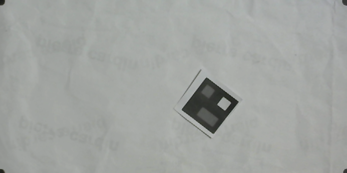
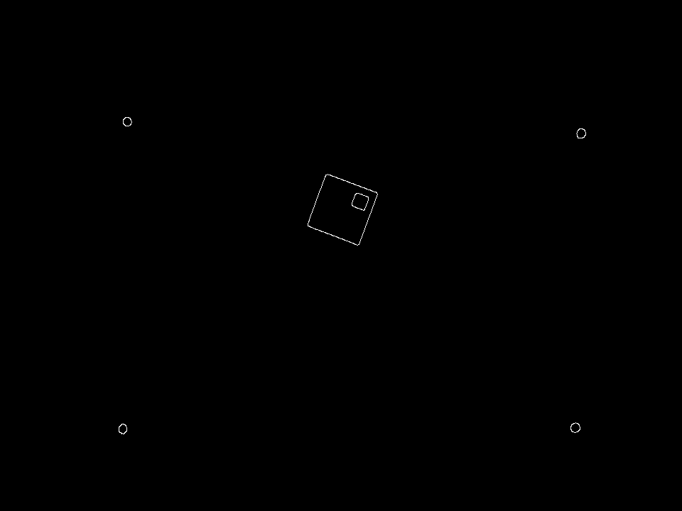

[](https://www.python.org/) [](https://shields.io/) [](https://pypi.python.org/pypi/ansicolortags/) [](https://shields.io/) [](https://shields.io/) [](https://shields.io/)
# Continuación Fase 1 de Algoritmo de Visión por Computadora.

## Introducción
El objetivo principal de este repositorio es brindarle al usuario una herramienta de _software_ diseñada para reconocer o identificar la posición de los agentes o robots, normalmente empleados en la Robótica de Enjambre.

Principalmente se presentan dos versiones para dos lenguajes distintos: __C++__ y __Python__.
La versión original de esta herramienta fue creada en __C++__ y como objetivo de la __Fase 2__ se presenta una migración hacia __Python___.
Ambas herramientas permiten la [_calibración de la cámara_](#calibración-de-cámara), la generación de [_marcadores_](#creación-de-marcadores) y la [_obtención de pose_](#obtención-de-pose) de los robots en la mesa de trabajo.

Para una mejor navegación, este _ReadMe_ contiene varios hipervinculos que permiten al usuario encontrar de mejor manera las secciones dentro de este documento o carpetas dentro de este repositorio.

## Indice:
1. [Introducción](#Introducción)

2. [Requerimientos](#Requerimientos)

   1. [Software](#versiones-soft)
      1. [Instalación OpenCV utilizando Anaconda y MacOS](#Anaconda_install)
      2. [Librerías utilizadas en Python](#lib_python)

   2. [Hardware](#versiones-hard)

3. [Contenido del Repositorio](#RepoContent)

4. [Algoritmo Para el Reconocimiento de la Pose de Agentes](#algoritmo-pose-python)

5. [Uso de la Herramienta](#Herramienta)

   1. [Calibración de Cámara](#calibración-de-cámara)

   2. [Creación de Marcadores](#creación-de-marcadores)

   3. [Obtención de Pose](#obtención-de-pose)


## Requerimientos <a name="Requerimientos"></a>
  ### Software <a name="versiones-soft"></a>
  Para la versión en Python se utiliza la Suite de Anaconda que incluye diferentes programas relacionados con Python. Es recomendable utilizar esta suite ya que incluye todos las librerías que se necesitan y hace más fácil la instalación de cualquier otra que se necesite.
  Su versión de instalación para Windows, MacOS y Linux se puede obtener de aquí: https://www.anaconda.com/products/individual
  La versión de Python utilizada fue __v3.7.6__, que es la versión por default que trae Anaconda con el IDE de Spyder.

  La herramienta desarrollada y migrada en __Python__ consta de dos archivos llamados _Swarm_robotic.py_ cuya versión es la 0.11.4, el archivo _toma_pose.py_, versión 0.3.2 y la Interfaz de usuario con versión _0.14.0_. Cada uno de estos programas esta debidamente comentado para que el usuario sepa en que versión está, cual ha sido el proceso de desarrollo y en que parte se encuentra cada uno de ellos.

  #### Instalación OpenCV utilizando Anaconda y MacOS <a name="Anaconda_install"></a>
  __Primero__
   Se requiere verificar que el comando de _conda_ funcione correctamente en MacOS, de lo contrario, realizar el siguiente proceso:
  https://medium.com/@sumitmenon/how-to-get-anaconda-to-work-with-oh-my-zsh-on-mac-os-x-7c1c7247d896
Este link ayuda a configurar el comando de conda para MacOS en caso de usarse para instalar python y OpenCV

__Segundo__   
  En caso de desear utilizar la suite de anaconda, se instala anaconda utilizando el instalador del sitio web oficial y se procede a seguir este hilo de solución:
  https://github.com/conda/conda/issues/9367

Específicamente, estos comandos son los que se necesita correr en la terminal:


```
conda create -n opencv
conda activate opencv
conda install -c anaconda opencv
```

estos comandos instalan la version 3.4.2 que para fines de uso, considero adecuados, si se desea la 4 (por alguna razón) ejecutar este comando (no probado)

```
conda install -c conda-forge opencv
```

esto instala opencv3

Se procede a instalar opencv en el environment de anaconda llamado OpenCV (creado con las líneas de comando mencionadas arriba) y se requiere instalar spyder en este nuevo environment (probado).

__Tercero__
  Esta versión de instalación se usa para correr OpenCV sin utilizar la Suite de Anaconda.

https://www.youtube.com/watch?v=nO3csmVyoOQ

Y en caso de falla, utilizar el siguiente en comando

```
pip install opencv-python==4.1.2.30
```

De preferencia, instalar python 3.7 (probado) no la version 3.8

#### Librerías utilizadas en Python <a name="lib_python"></a>
Para una referencia, estas son las librerías que se usan en los distintos códigos de esta herramienta de __Python__:

1. cv2 #importando libreria para opencv

2. numpy #para la creacion de arrays

3. math #para el uso de herramientas matematicas como raiz cuadrada

4. from Swarm_robotic import camara, vector_robot, Robot #libreria swarm para la deteccion de la pose de agentes (incluida en este repositorio).

5. from toma_pose import getRobot_fromSnapshot, process_image #para la deteccion de pose de los robots (incluida en este repositorio).

6. threading #para los hilos

7. time #delays y otros tiempos de medición

Librerias para la GUI, en teoria se puede usar __PyQt__ por que las funciones son las mismas aunque algunos metodos cambian. Se recomienda instalar __PySide2__ para compatibilidad con la versión de este repositorio.

1. from PySide2.QtCore import Qt

2. from PySide2.QtWidgets import QLabel, QApplication, QWidget, QPushButton,QLineEdit

3. sys

4. from PySide2.QtGui import QImage, QPixmap


  ### Hardware <a name="versiones-hard"></a>

## Contenido del Repositorio <a name="RepoContent"></a>
### Fase 2
Los programas están ubicados en la carpeta [__Codigos__](Codigos). Estos códigos son todos los programas utilizados para la herramienta de la toma de pose, creación de marcadores y calibración de la cámara. Están implementados en Python y C++ con implementación de POO y programación multi-hilos. Además, incluyen otros programas de ejemplos y referencias para el uso de la herramienta, así como ilustrar el uso de multi-hilos y las funciones de OpenCV.

Los documentos como manuales, la tesis de la fase 2 y otra documentación están ubicados en la carpeta [__Doc__](Doc).

## Algoritmo Para el Reconocimiento de la Pose de Agentes <a name="algoritmo-pose-python"></a>
El algoritmo fue originalmente desarrollo por André Rodas en el lenguaje de programación __C++__.
Él desarrolló una primera versión de una herramienta que incluyera una calibración de cámara, una creación de marcadores o identificadores para los robots y un programa que obtuviera la pose de los robots en la mesa.

Con el objetivo de desarrollar una herramienta más versátil, y que tuviera una ampliación en sus aplicaciones, se migró estos programas a una versión en __Python__ que incluye las mismas funciones. Además de eso, el objetivo era desarrollar una herramienta más eficiente y que fuera modular. Con esto en mente, se realizó mejoras a la versión presentada por André. Entre estas mejoras se encuentra el uso de multi-hilos (tanto en __C++__ como en __Python__) que ayudan a realizar multiples tareas al mismo tiempo y da modularidad y paralelización al código. Segundo, se implementó Programación Orientada a Objetos para darle más modularidad a las diferentes funciones del código. Finalmente, se realizaron algunos cambios en distintas partes del código que suponen una mejora en la experiencia del usuario al momento de usar la herramienta en __Python__.


## Uso de la Herramienta <a name="Herramienta"></a>
### Calibración de Cámara
La calibración de la cámara consiste en tomar de referencia 4 puntos dentro de la mesa de trabajo para ser utilizados como nuevas esquinas de la imagen. El objetivo de esto es que cuando la cámara tome una fotografía de la mesa, le aplique corrección de perspectiva (si la necesitara) así como recortar la imagen y dejar únicamente los puntos de interés.

Un ejemplo claro de calibración de cámara es lo que utiliza CamScanner al momento de escanear un documento:
Se toma la foto de la página que se desea escanear, luego, la aplicación corrige la perspectiva de la foto para que tenga una mejor vista frontal (es decir que si el escaneo se hace un poco de inclinado, la imagen final no presente esa inclinación). Todo esto lo hace tomando 4 puntos de referencia, los mismos que toma este algoritmo para calibrar la cámara con respecto a la mesa de trabajo.

La imagen siguiente muestra un ejemplo de una calibración exitosa.



Para lograr el anterior resultado (tanto en __Python__ como en __C++__) se necesita que las esquinas marcadas contrasten altamente con la mesa (que sea un color que resalte). En el caso de __Python__, se necesita que las formas sean circulares o lo más cercano a un círculo y que no existan objetos __fuera__ del área de interés, ya que esto podría hacer que el programa tome dichas objetos como posibles esquinas. En el caso de __C++__ también aplica esto aunque puede que con otras figuras funcione de igual forma.

El procedimiento para calibrar se hace mediante la detección de bordes o contornos de en la imagen. Dichos contornos son identificados utilizando la función de __Detección de Bordes de Canny__ de _OpenCV_. La siguiente imagen muestra el resultado de aplicar el _filtro de Canny_ a la imagen. Como se observa, el filtro es capaz de reconocer 4 esquinas (las marcadas en la mesa), así como otras figuras que en este caso representa un robot. Sin embargo, el algoritmo esta diseñado para buscar contornos circulares, y además de eso, que los contornos estén lo más cercano a los bordes de la imagen original. Si estás dos condiciones se cumplen, tomará estos puntos como las esquinas y a partir de estas generará la calibración de la cámara.




### Creación de Marcadores
### Obtención de Pose
